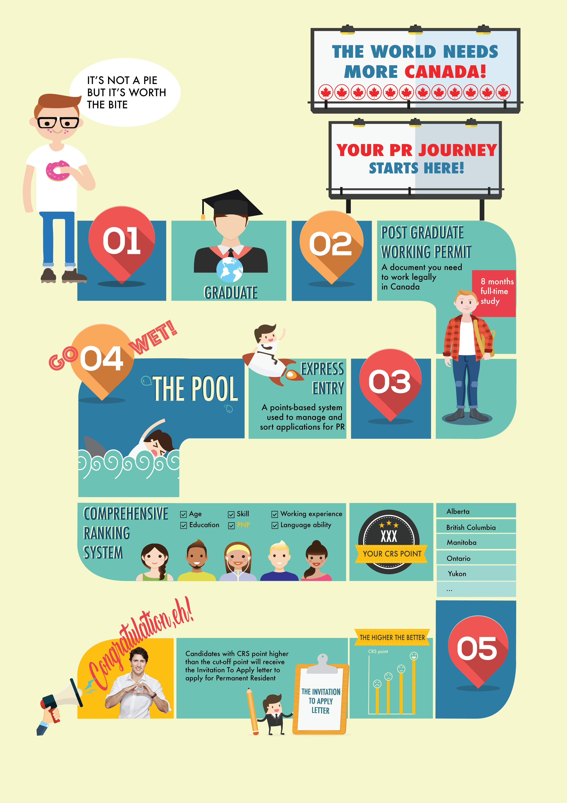

# HTML_Infographic_PRJourney

As an final project for the User Experience course, my teammate, Sarah, dediced to create an infographic about the journey of an international student from the day they graduate to the day they get their permanent residency in Canada.

I was the one who in charge of the final design and the content of the infographi. I used stock images from freepik, collor pallets from colourlovers as resource to create the design in Adobe Illustrator and Adobe Photoshop.
Sarah took the responsibility for the HTML and animation of the web version. 

Inspirations

